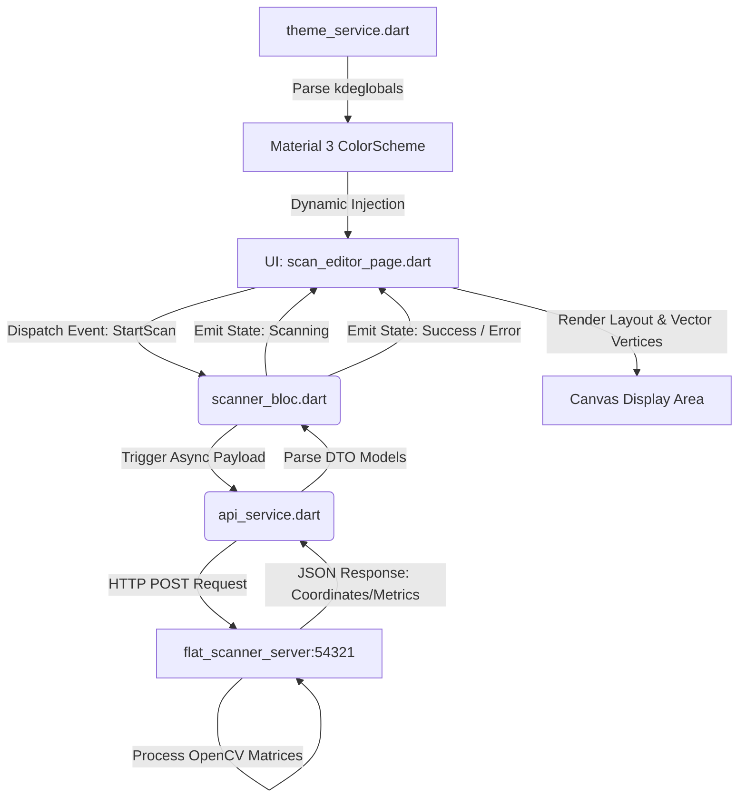

# Flat Scanner Client

🌐 **English** | [Русский](README.ru.md)

High-performance native Linux desktop application built with Flutter (Linux x64) for professional book digitization. It acts as the orchestration frontend for the asynchronous `flat-scanner-server` (Core Engine) via HTTP/JSON protocol wrappers. 

Features seamless native adaptive integration with **KDE Plasma environments (Breeze)** by directly parsing `kdeglobals` configuration vectors into runtime Material 3 ColorSchemes.



---

## Architecture Topology

The codebase implements a strict separation of concerns following **Clean Architecture** patterns combined with predictable unidirectional data streams:

```
lib/
├── main.dart                     # Bootstrapper, window_manager layer, MultiBlocProvider setup
├── data/                         # Data Layer (Hardware infrastructure access & configurations)
│   ├── api_service.dart          # Low-level HTTP client implementation linking to the daemon
│   ├── models.dart               # Type-safe DTO structures (ScanProfile, ScanResponse, PageVertex)
│   └── theme_service.dart        # Core system hooks: direct kdeglobals parser -> Material 3 layout
├── domain/                       # Business Logic Layer (State machine management mechanics)
│   └── scanner_bloc.dart         # BlOC engine mapping incoming actions into strict UI states
└── presentation/                 # Presentation Layer (Declarative reactive layout wrappers)
└── scan_editor_page.dart         # Canvas viewport, matrix presets dropdown, fullscreen toggle
```

---

## Core Dependencies (`pubspec.yaml`)

* `flutter_bloc` & `bloc` (v9.x): Enterprise state machine management pipeline.
* `equatable`: Value-based object comparison (prevents redundant UI frame re-renders).
* `window_manager`: Low-level native Linux window frame manipulation (frameless modes, full-screen hooks).
* `gtk`: Low-level GTK standard bindings for deep Linux desktop shell integration.

---

## Compilation & Native Deployment

### 1. Development Toolkit Setup
To build the system natively on an Arch Linux or Melawy OS target, verify the compilation dependencies are met:
```bash
sudo pacman -S gtk3 libnotify libuuid libxkbcommon flutter
```

### 2. Manual Binary Assembly
```bash
flutter pub get
flutter build linux --release
```
The compiled self-contained bundle will be emitted to: `build/linux/x64/release/bundle/`

---

## System Integration (Arch Linux / Melawy OS Packaging)

The production build requires all binaries, assets, and shared libraries (`libflutter_linux_gtk.so`) to reside under a shared execution space to comply with strict Linux dynamic linking loaders. Packaging is handled automatically via native **PKGBUILD**.

To compile, verify dependencies, and install the complete client build with a single command:
```bash
makepkg -si
```

### Deployed File Manifest Blueprint
* `/usr/lib/flat-scanner-client/` — Isolated runtime execution container (binary, shared libraries, asset tree).
* `/usr/bin/flat-scanner-client` — System-wide executable link targeting the bundle loader.
* `/usr/share/applications/flat-scanner-client.desktop` — Desktop XDG environment specification file.
