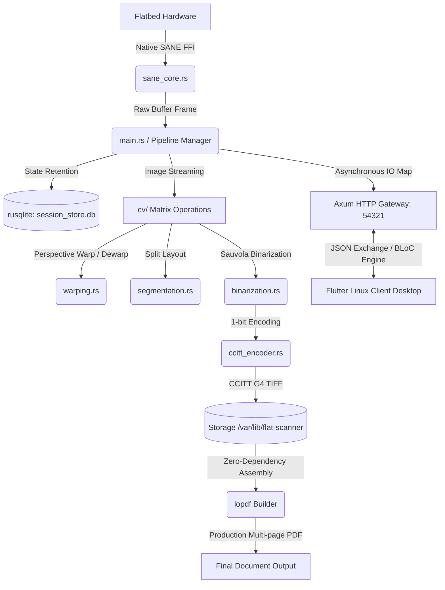

# Flat Scanner Server (Core Engine)

🌐 **English** | [Русский](README.ru.md)

High-performance, dual-mode system engine for professional book digitization and image processing without heavy OCR overhead. It captures raw frame buffers directly from flatbed hardware via native SANE API interfaces, performs real-time geometric page boundary detection, executes perspective warping correction, applies spline-based book spine dewarping, splits dual-page spreads, eliminates skew, and bi-tonally encodes outputs using the fast adaptive Sauvola thresholding algorithm.

Final outputs are natively compressed and stored as ultra-lightweight 1-bit CCITT Group 4 TIFF/PNG structures or compiled directly into multi-page PDFs.



---

## Technical Stack & Dependencies

* **Language Runtime:** Rust (Modern Enterprise Edition 2024)
* **Async IO Framework:** Axum & Tokio Ecosystem (Non-blocking HTTP Gateway architecture)
* **Computer Vision Engine:** OpenCV 4.x via low-level native bindings (Fitted matrix manipulations)
* **Hardware Interface:** SANE (Scanner Access Now Easy) API abstractions
* **Storage Layer:** Transactional SQLite engine (`rusqlite` embedded compilation)
* **PDF Synthesis:** `lopdf` stream writer for direct memory-to-disk document compilation

### Prerequisites (System Deployment on Arch Linux)
```bash
sudo pacman -S opencv sane libtiff sqlite pkg-config
```

---

## Operating Modes

### 1. Embedded Web Gateway Mode (Default Operational State)
Monitors incoming network sockets or local interface hooks (`127.0.0.1:54321` by default) to ingest remote instructions from the automated Flutter desktop frontend.
```bash
cargo run --release
```

### 2. Standalone Headless CLI Mode
Bypasses the network network loop entirely to process massive offline batches or pre-loaded raw image matrices directly from storage.
```bash
cargo run --release -- --cli --output-dir ./split --k-factor 0.2
# Processing a pre-loaded local dual-page spread file:
cargo run --release -- --cli --input-file spread.png
```

---

## Configuration Layering & Environment Context

Binding address resolution priority chain is evaluated as: **CLI Arguments > config.toml Context > Fallback System Defaults**.

### CLI Execution Injections
```bash
cargo run --release -- --host 0.0.0.0 --port 8080
```

### Decoupled Configuration Pattern (`config.toml`)
```toml
[server]
host = "127.0.0.1"   # Restrict to local interface layer for default sandbox security
port = 54321
```

The system looks for the environment profile using the following strict priority scanpath:
1. `$FLAT_SCANNER_CONFIG` (Dedicated environment variable injection vector, mapped inside Systemd units)
2. `~/.config/flat-scanner-server/config.toml` (User-space local overlay overrides)
3. `/etc/flat-scanner-server/config.toml` (System-wide default runtime layout deployed by custom PKGBUILD routines)

---

## API Architecture Reference Matrix

| HTTP Method | Route Profile | Operational Scope |
| :--- | :--- | :--- |
| **GET** | `/api/v1/health` | Diagnostic heartbeat evaluation of the core daemon state. |
| **POST** | `/api/v1/scanner/init` | Dispatches hardware-level instructions to recalibrate/initialize the flatbed carriage. |
| **POST** | `/api/v1/scanner/process` | Executes the complete real-time acquisition and OpenCV matrix transform chain. |

### Payload Contract (`/api/v1/scanner/process`)
```json
{
  "uuid": "e2a4c8b1-5936-4d7a-b82d-411a0c4f82a9",
  "threshold_preset": 0,
  "profile": "text_bw_1bit"
}
```
* **Supported Core Evaluation Profiles:**
  * `text_bw_1bit`: Strict text processing, custom 1-bit adaptive thresholding, native CCITT G4 TIFF encapsulation.
  * `illustration_grayscale_8bit`: Preserves fine-art or graphical halftones, 8-bit quantization channels, PNG storage.
  * `color_rgb_24bit`: Full chromatic retention, 24-bit uncompressed RGB channels, PNG format output.

---

## Core System Integration (Systemd & Arch Packaging)

The daemon executes as an isolated background task, structured via optimized runtime limits (`LimitNOFILE=65536`) and strict Linux sandboxing guidelines (`NoNewPrivileges=true`).

```bash
# Register, configure, and activate the daemon instance immediately
sudo systemctl enable --now flat-scanner-server

# Real-time state audit and continuous system logging checks
sudo systemctl status flat-scanner-server
journalctl -u flat-scanner-server -f
```

### Package Manifest Output Map (PKGBUILD Deployments)
* `/usr/bin/flat_scanner_server` — High-efficiency, zero-dependency release binary.
* `/usr/lib/systemd/system/flat-scanner-server.service` — Active service configuration mappings.
* `/etc/flat-scanner-server/config.toml` — Immutable global server definitions.
* `/var/lib/flat-scanner/` — State directory (`data.db`, `calibration.json`, hot-restart session traces).

---

## Verification & Suite Diagnostics
```bash
cargo test --release
```
