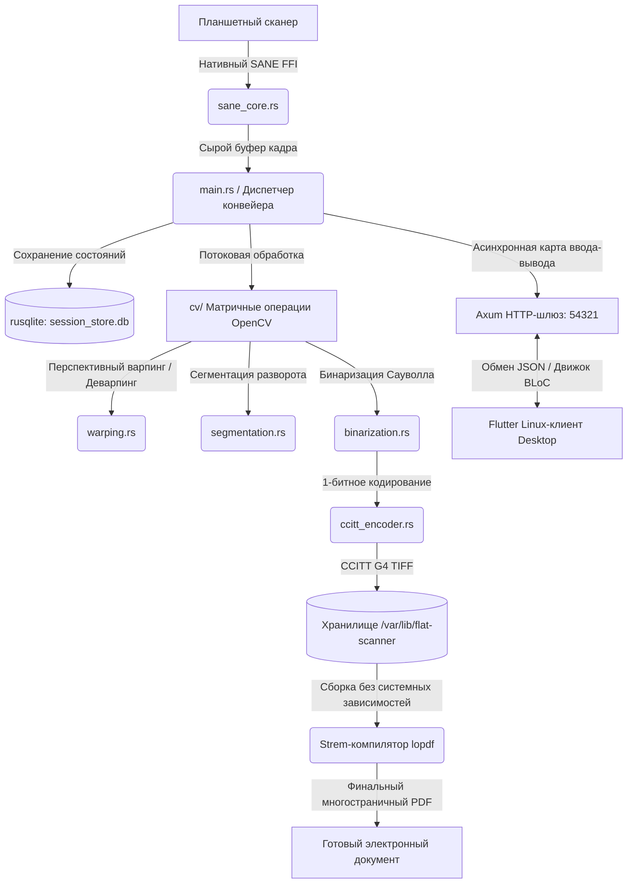

# Flat Scanner Server (Core Engine)

🌐 [English](README.md) | **Русский**

Высокопроизводительное двухрежимное системное ядро для профессиональной оцифровки книг и потоковой обработки изображений без избыточной нагрузки в виде OCR. Движок напрямую захватывает сырые кадры с планшетных сканеров через нативный интерфейс SANE API, выполняет детекцию вершин страниц в реальном времени, осуществляет перспективную коррекцию матриц, деварпинг корешка книги на основе сплайнов, сегментирует двухстраничные развороты, устраняет скос (дескью) и производит бинаризацию по быстрому адаптивному алгоритму Сауволла.

Финальные файлы кодируются без потери качества в сверхлегкие 1-битные структуры CCITT Group 4 TIFF/PNG или компилируются напрямую в многостраничные PDF-документы.



---

## Технологический стек и зависимости

* **Язык разработки:** Rust (Современная промышленная редакция Edition 2024)
* **Асинхронное сетевое ядро:** Экосистема Axum и Tokio (Неблокирующий многопоточный HTTP-шлюз)
* **Компьютерное зрение:** OpenCV 4.x через низкоуровневые нативные биндинги (оптимизированные матричные манипуляции)
* **Интерфейс оборудования:** Слой абстракции SANE (Scanner Access Now Easy) API
* **Транзакционное хранилище:** Встраиваемая база данных SQLite (вкомпилированный движок `rusqlite`)
* **Синтез документов:** Потоковый генератор `lopdf` для прямой компиляции документов из памяти на диск

### Системные зависимости (Развертывание в Arch Linux)
```bash
sudo pacman -S opencv sane libtiff sqlite pkg-config
```

---

## Режимы работы

### 1. Веб-интерфейс (Сетевой шлюз по умолчанию)
Слушает входящие сетевые сокеты или локальный интерфейс петли обратной связи (`127.0.0.1:54321` по умолчанию) для приема удаленных JSON-команд от автоматизированного десктопного фронтенда на Flutter.
```bash
cargo run --release
```

### 2. Автономный CLI-режим (Headless)
Полностью обходит сетевой цикл для пакетной обработки массивных офлайн-архивов или предварительно загруженных графических матриц напрямую из файловой системы.
```bash
cargo run --release -- --cli --output-dir ./split --k-factor 0.2
# Обработка ранее сохраненного файла разворота книги:
cargo run --release -- --cli --input-file spread.png
```

---

## Конфигурационный слой и контекст окружения

Приоритет источников инициализации bind-адреса выстраивается в строгую цепочку: **Флаги CLI > Контекст config.toml > Системные дефолты**.

### Переопределение через аргументы командной строки
```bash
cargo run --release -- --host 0.0.0.0 --port 8080
```

### Изолированный файл конфигурации (`config.toml`)
```toml
[server]
host = "127.0.0.1"   # Ограничение локальным интерфейсом безопасности по умолчанию
port = 54321
```

Поиск конфигурационного профиля сервером осуществляется по следующему пути приоритетов:
1. `$FLAT_SCANNER_CONFIG` (Специализированная переменная окружения, прописываемая внутри Systemd-юнитов)
2. `~/.config/flat-scanner-server/config.toml` (Пользовательские локальные оверлеи)
3. `/etc/flat-scanner-server/config.toml` (Глобальные системные настройки, разворачиваемые через PKGBUILD)

---

## Справочная матрица архитектуры API

| Метод HTTP | Путь (Route) | Область действия |
| :--- | :--- | :--- |
| **GET** | `/api/v1/health` | Диагностическая проверка работоспособности и доступности демона. |
| **POST** | `/api/v1/scanner/init` | Отправка низкоуровневых команд оборудованию для калибровки и инициализации каретки. |
| **POST** | `/api/v1/scanner/process` | Запуск полного цикла захвата кадра со сканера и матричных трансформаций OpenCV. |

### Контракт входящих данных (Payload) для `/api/v1/scanner/process`
```json
{
  "uuid": "e2a4c8b1-5936-4d7a-b82d-411a0c4f82a9",
  "threshold_preset": 0,
  "profile": "text_bw_1bit"
}
```
* **Поддерживаемые профили обработки матриц:**
  * `text_bw_1bit`: Строго текстовый режим, адаптивный 1-битный порог, нативная упаковка в CCITT G4 TIFF.
  * `illustration_grayscale_8bit`: Сохранение полутонов графики или иллюстраций, 8-битные каналы квантования, формат PNG.
  * `color_rgb_24bit`: Полное сохранение цветности, 24-битные несжатые каналы RGB, формат PNG.

---

## Системная интеграция (Systemd и сборка пакета)

Демон выполняется как изолированная фоновая служба операционной системы, настроенная с учетом повышенных лимитов ресурсов (`LimitNOFILE=65536`) и строгих политик безопасности Linux (`NoNewPrivileges=true`).

```bash
# Регистрация, настройка автозапуска и немедленная активация демона
sudo systemctl enable --now flat-scanner-server

# Проверка текущего статуса службы и просмотр логов в реальном времени
sudo systemctl status flat-scanner-server
journalctl -u flat-scanner-server -f
```

### Карта размещения файлов при развертывании пакета (PKGBUILD)
* `/usr/bin/flat_scanner_server` — Высокоэффективный релизный бинарный файл ядра.
* `/usr/lib/systemd/system/flat-scanner-server.service` — Активный конфигурационный юнит инициализации службы.
* `/etc/flat-scanner-server/config.toml` — Защищенные глобальные настройки сервера.
* `/var/lib/flat-scanner/` — Системная директория состояний (`kanonissa.db`, `calibration.json`, дампы сессий).

---

## Тестирование и диагностика ядра
```bash
cargo test --release
```
